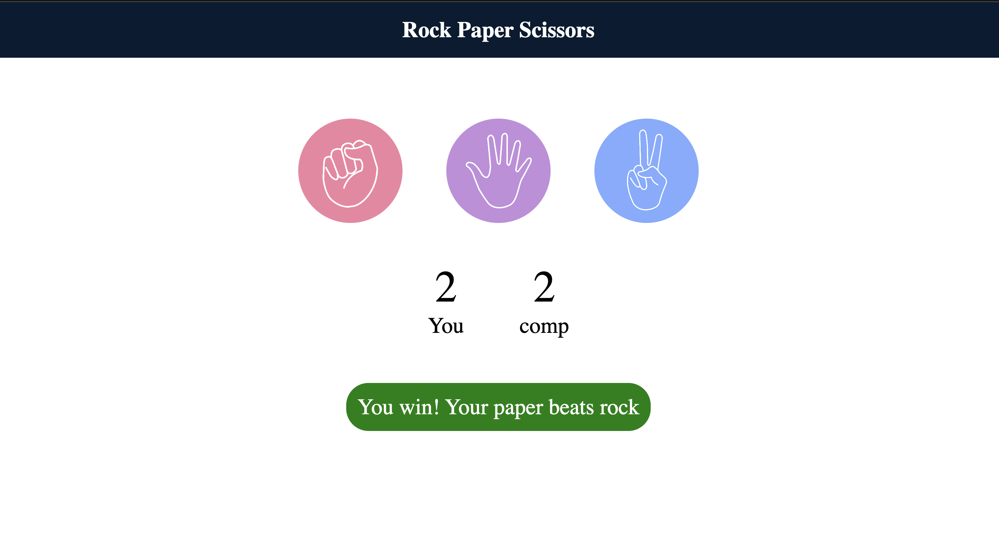

✊✋✌️ Rock Paper Scissors Game

A simple, interactive Rock Paper Scissors game built using vanilla JavaScript, HTML, and CSS — play against the computer with real-time score tracking and instant win/lose/draw feedback.

🔴 Live Demo

Play it here

<!-- Add your Netlify link once deployed, e.g. https://rock-paper-scissors-sanidhya.netlify.app -->
📸 Screenshot

Add a screenshot of your game here

✨ Features

Click-based gameplay — choose Rock, Paper, or Scissors
Computer randomly generates its choice
Real-time score tracking for both Player and Computer
Dynamic message display with color feedback:

🟢 Green background on win
🔴 Red background on loss
🔵 Blue background on draw

Clean circular UI with hover effects
Fully responsive layout using Flexbox

🛠️ Tech Stack

HTML5 — structure
CSS3 — styling, flexbox layout, hover effects
JavaScript (Vanilla) — game logic, DOM manipulation, event listeners

🚀 How to Run Locally

Clone the repository

bash   git clone https://github.com/your-username/rock-paper-scissors.git

Navigate into the project folder

bash   cd rock-paper-scissors

Open index.html in your browser

bash   open index.html

(or just double-click the file)

📂 Project Structure

rock-paper-scissors/
├── index.html
├── style.css
├── app.js
├── images/
│   ├── rock.png
│   ├── paper.png
│   └── scissors.png
└── README.md

🧠 How It Works

Each choice (rock, paper, scissors) is a clickable div with an id matching the choice name
On click, the user's choice is compared against a randomly generated computer choice
Game logic uses simple conditional checks to determine the winner based on classic Rock-Paper-Scissors rules
Score and message update dynamically in the DOM without reloading the page

🧠 What I Learned

DOM manipulation using querySelector and querySelectorAll
Event handling with addEventListener and forEach
Writing clean conditional logic for game rules (win/lose/draw)
Dynamically updating styles and text content via JavaScript

📬 Contact

Sanidhya Nigam
LinkedIn: https://www.linkedin.com/in/sanidhya-nigam-669304398

⭐ If you liked this project, consider giving it a star!